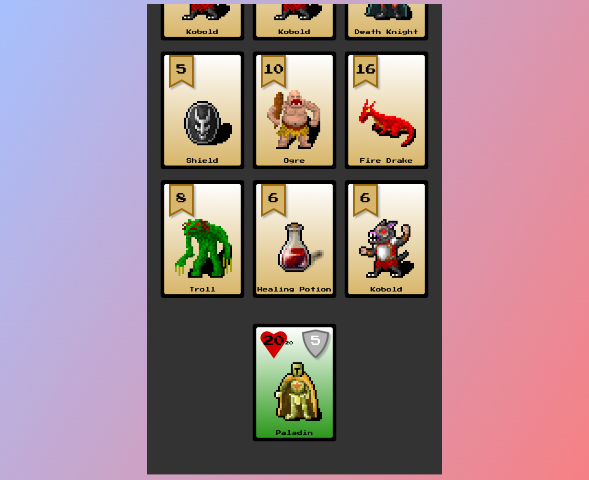

## 👾 Card Paladin

A web-based rouge-like card game implemented by JavaScript (ES6) using Phaser 3.

Play: https://ybhan.github.io/card-game/

The Press Start 2P Font is obtained from Bitmap Font Generator; image assets come from [Open Game Art](https://opengameart.org/).
